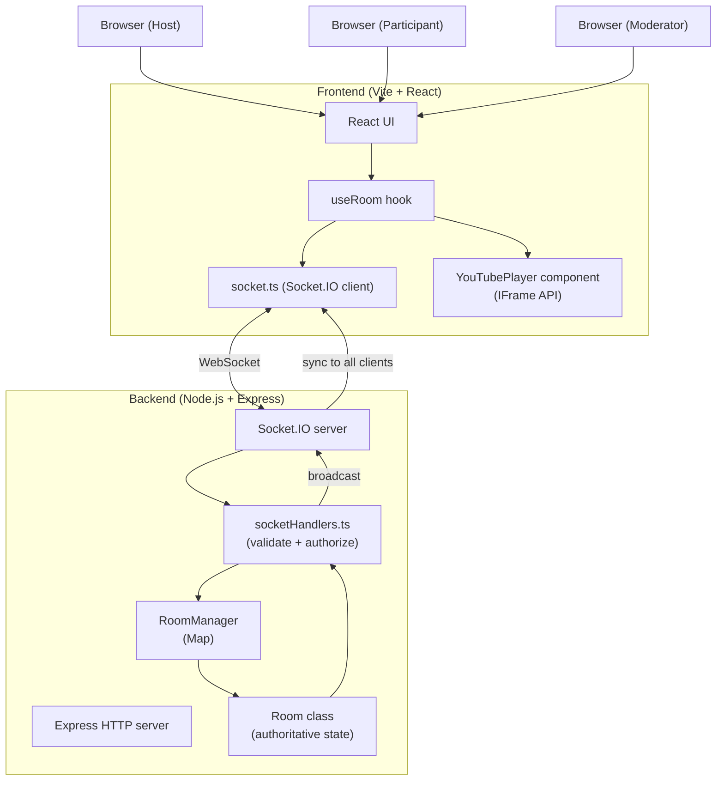
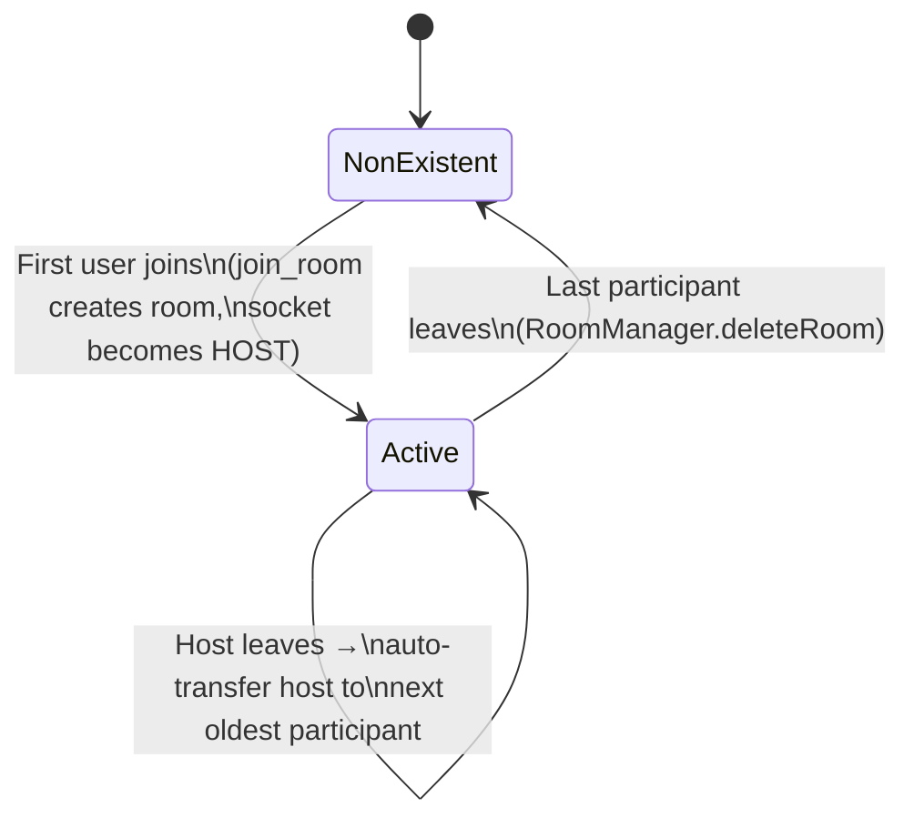
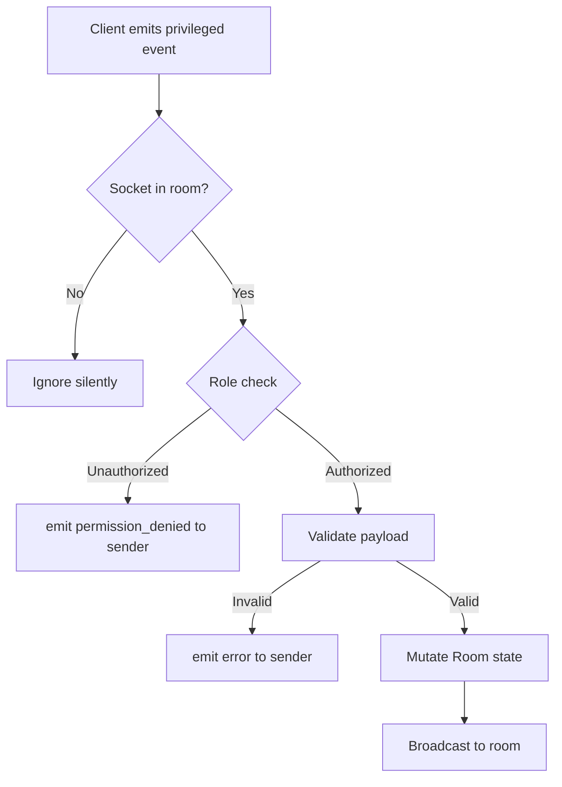

# Architecture — YouTube Watch Party

---

## 1. System Overview

The system has two deployable units — a **React frontend** and a **Node.js backend** — that communicate exclusively over **Socket.IO WebSockets**. There is no REST API for room state; everything is event-driven.



---

## 2. Frontend Architecture

```
frontend/src/
├── main.tsx              Entry point — mounts React with BrowserRouter
├── App.tsx               Route table: / → Home, /room/:roomId → Room
├── vite-env.d.ts         Vite type declarations (import.meta.env)
├── index.css             Global styles (dark theme, layout, components)
│
├── pages/
│   ├── Home.tsx          Landing page — create/join form
│   └── Room.tsx          Watch room — orchestrates all sub-components
│
├── components/
│   ├── YouTubePlayer.tsx  IFrame API wrapper (forwardRef, useImperativeHandle)
│   ├── VideoControls.tsx  Play/Pause/Seek/Change video buttons
│   └── ParticipantList.tsx Participant list with host management controls
│
├── hooks/
│   └── useRoom.ts        Core state + Socket.IO logic for the room session
│
├── services/
│   └── socket.ts         Single Socket.IO client instance (autoConnect: false)
│
├── types/
│   └── index.ts          Shared TypeScript types (Role, Participant, payloads)
│
└── utils/
    ├── roomId.ts         Client-side room ID generator (crypto.getRandomValues)
    └── youtube.ts        YouTube URL → videoId extractor
```

### Data flow — user presses Play button

```
VideoControls (onPlay button)
  └─ calls sendPlay(currentTime) from useRoom
       └─ socket.emit('play', { roomId, currentTime })
            └─ [network] → server validates → broadcasts
                 └─ socket.on('play') in useRoom
                      └─ sets remoteCommandRef.current = { type: 'play', ... }
                           └─ 100ms interval in YouTubePlayer reads ref
                                └─ player.playVideo()
```

---

## 3. Backend Architecture

```
backend/src/
├── server.ts             HTTP + Socket.IO server, starts listening
├── app.ts                Express app (CORS, health check)
│
├── socket/
│   ├── socketEvents.ts   Event name constants (CLIENT_EVENTS, SERVER_EVENTS)
│   └── socketHandlers.ts All socket event handlers — registered per connection
│
├── rooms/
│   ├── Room.ts           Room class — authoritative playback + participant state
│   └── RoomManager.ts    Singleton Map of all rooms, exported as `roomManager`
│
├── types/
│   └── index.ts          All TypeScript types and payload interfaces
│
└── utils/
    ├── generateRoomId.ts  Crypto-random 6-char room ID
    └── permissions.ts     canControlPlayback(), isValidVideoId(), isValidTime()
```

### Key design choice — business logic in Room, not in handlers

`socketHandlers.ts` is intentionally thin. Each handler does three things only:
1. Parse and validate the payload
2. Call the relevant `Room` or `RoomManager` method
3. Broadcast the result

All state mutation lives inside `Room.ts`. This makes the logic testable in isolation and keeps handlers readable.

---

## 4. Room Lifecycle



### Room state structure (in memory)

```typescript
{
  roomId: string          // e.g. "AB12CD"
  hostId: string          // socket.id of current host
  videoId: string         // YouTube video ID
  playState: "playing" | "paused"
  currentTime: number     // seconds — last recorded position
  lastUpdatedAt: number   // Date.now() when currentTime was saved
  participants: Map<socketId, Participant>
}
```

`getEstimatedCurrentTime()` compensates for network delay when sending state to new joiners: if `playState === 'playing'`, it adds `(Date.now() - lastUpdatedAt) / 1000` to `currentTime`.

---

## 5. WebSocket Event Flow

### Play event (Host → all)

```
Host client                Server                  All other clients
    │                         │                         │
    │──── emit('play') ───────►│                         │
    │     { roomId, time }     │                         │
    │                         │ validate socket in room  │
    │                         │ check role === HOST|MOD  │
    │                         │ room.updatePlayback()    │
    │                         │──── emit('play') ───────►│
    │                         │     { currentTime }      │
    │                         │                         │ isApplyingRemoteRef=true
    │                         │                         │ player.playVideo()
    │                         │                         │ onStateChange fires
    │                         │                         │ isApplyingRemoteRef→skip emit ✓
```

### Join event — new user receives current state

```
New client               Server
    │                       │
    │── emit('join_room') ──►│
    │                       │ room exists? yes → addParticipant
    │                       │ room.getEstimatedCurrentTime()
    │◄── emit('sync_state') ─│
    │  { videoId,            │
    │    playState,          │
    │    currentTime+offset, │── emit('user_joined') → all others
    │    participants }      │
    │                        │
    │ YouTubePlayer loads video at currentTime
    │ If playState=playing → player.playVideo()
```

---

## 6. YouTube Synchronization Flow

```
index.html loads https://www.youtube.com/iframe_api
    │
    ▼
window.onYouTubeIframeAPIReady fires
    │
    ▼
YouTubePlayer.tsx creates YT.Player instance
    │
    ├─ onReady → playerRef.current = player, isReadyRef = true
    │
    └─ onStateChange(state) →
          PLAYING → onPlay(currentTime) → socket.emit('play')  [if not remote]
          PAUSED  → onPause / onSeek    → socket.emit(...)     [if not remote]

Remote command application:
    setInterval(100ms) polls remoteCommandRef.current
    if command exists and player is ready:
        isApplyingRemoteRef.current = true
        applyRemoteCommand(cmd)  →  player.playVideo() / seekTo() / etc.
        remoteCommandRef.current = null  (consumed)
```

---

## 7. RBAC Flow



Roles and what they can do:

| Role        | Control playback | Assign roles | Remove participants |
|-------------|-----------------|--------------|---------------------|
| HOST        | ✅              | ✅           | ✅                  |
| MODERATOR   | ✅              | ❌           | ❌                  |
| PARTICIPANT | ❌              | ❌           | ❌                  |

Role assignment uses `socket.id` as the identity key — never anything the client sends in the payload body.

---

## 8. Error Handling

| Scenario                        | Backend behavior                          | Frontend behavior                      |
|---------------------------------|-------------------------------------------|----------------------------------------|
| Invalid room ID                 | Room not found → no action                | Error toast shown                      |
| Username already taken          | `error` event with message                | Error toast shown                      |
| Invalid YouTube video ID        | `error` event, no state change            | Inline form error                      |
| Unauthorized event              | `permission_denied` event                 | Error toast shown                      |
| Socket disconnect               | `handleParticipantLeave()`, host transfer | `USER_LEFT` broadcast, UI updates      |
| Last participant leaves         | Room deleted from RoomManager             | N/A                                    |
| Kicked participant              | `you_were_removed` + `participant_removed`| Redirected to Home after 3s            |
| Invalid seek time               | Rejected, `error` event                   | Inline form error                      |
| YouTube player error            | N/A                                       | Logged to console                      |
| Server unreachable              | N/A                                       | `connect_error` → error toast          |

---

## 9. Deployment Architecture

```
                    ┌─────────────────────┐
                    │   Vercel / Netlify   │
                    │   (Static hosting)   │
                    │                      │
                    │  frontend/dist/      │
                    │  React SPA           │
                    └──────────┬──────────┘
                               │ HTTPS (initial page load)
                               │ WSS (WebSocket upgrade)
                               ▼
                    ┌─────────────────────┐
                    │       Render        │
                    │   (Node.js server)  │
                    │                     │
                    │  backend/dist/      │
                    │  server.js          │
                    │  PORT=4000 (Render  │
                    │  assigns dynamic)   │
                    └─────────────────────┘
```

**CORS**: The backend reads `FRONTEND_URL` from the environment and only allows that origin. The Socket.IO server mirrors the same setting.

**WebSocket on Render**: Render supports WebSocket connections on standard web services. Socket.IO's ping/pong keepalive (`pingInterval: 25000`, `pingTimeout: 60000`) prevents Render's 55-second idle timeout from closing connections mid-session.

---

## 10. Future Scalability

| Concern                  | Current state                  | Upgrade path                                       |
|--------------------------|--------------------------------|----------------------------------------------------|
| Room persistence         | In-memory Map                  | Replace `RoomManager` with DB-backed store         |
| Multi-instance scaling   | Single process                 | Socket.IO Redis adapter + sticky sessions          |
| Authentication           | Username only                  | JWT / OAuth, attach userId to socket on connect    |
| Room expiry              | Never (until empty)            | TTL on Room, background cleanup job                |
| Chat history             | No persistence                 | Append to Room.messages[], persist to DB           |
| Video queue              | Single video                   | Add `Room.queue: string[]`, next/previous events   |
| Rate limiting            | None                           | Per-socket event throttle in handlers              |
